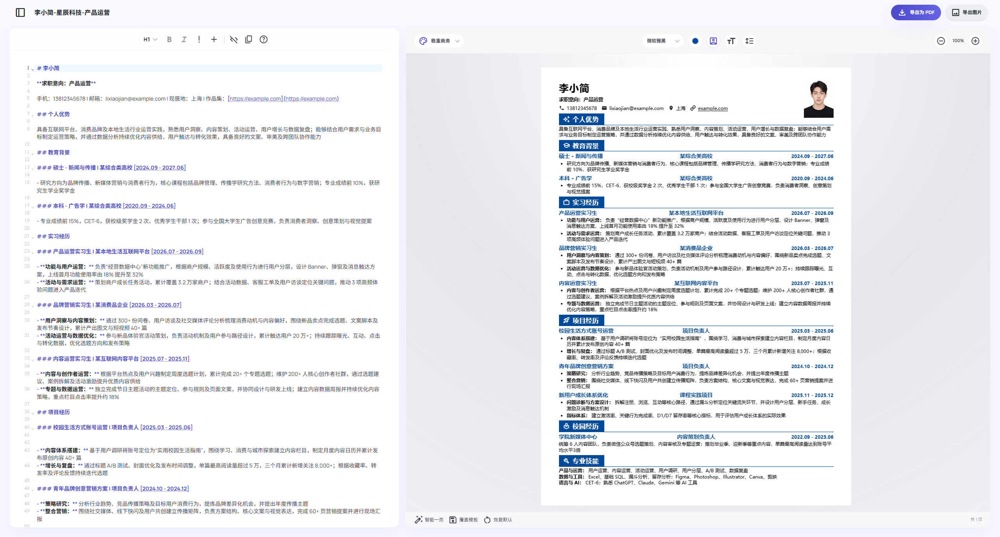
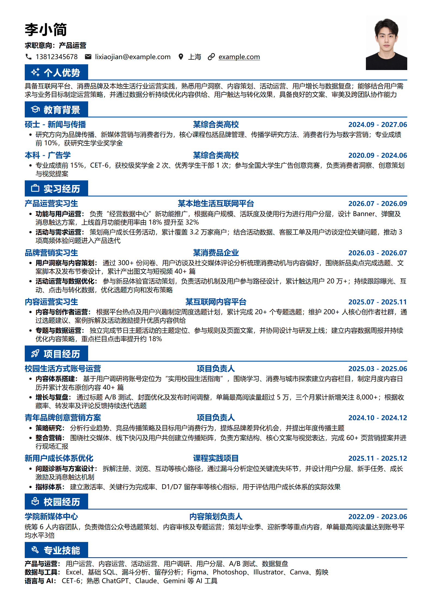
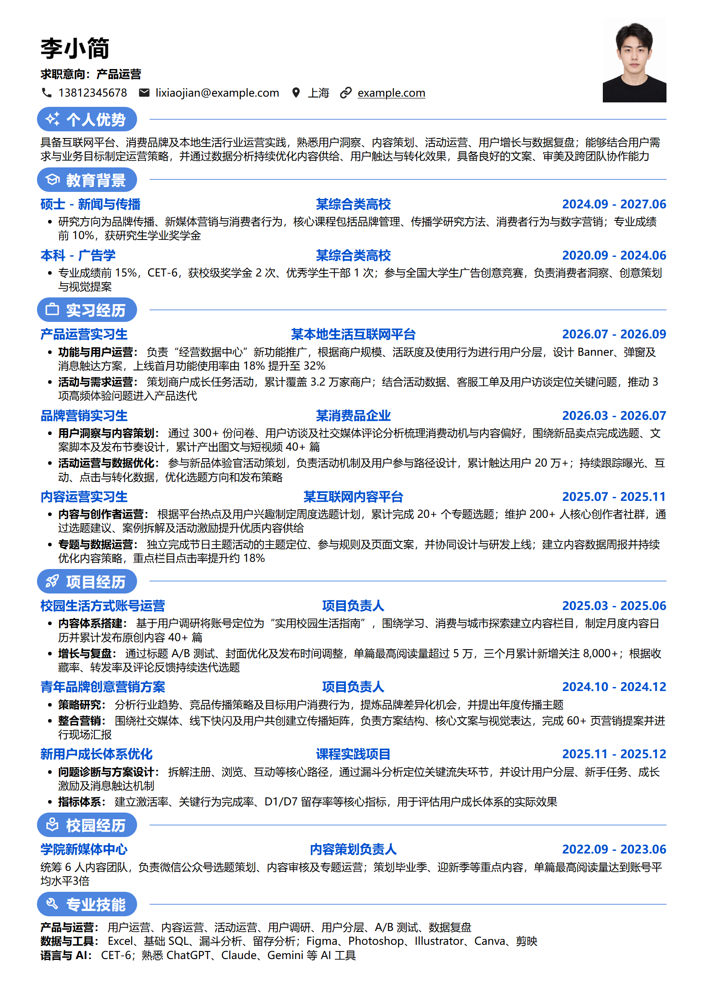
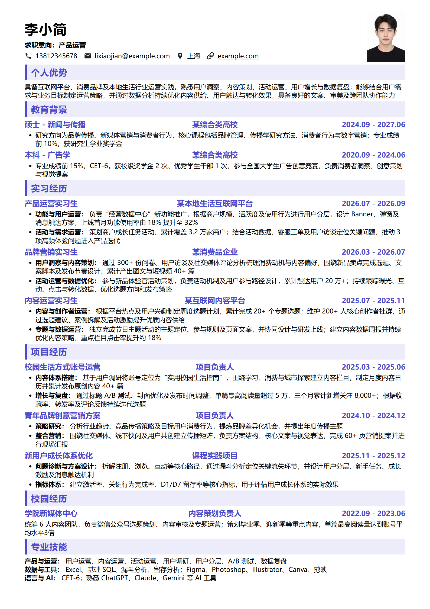
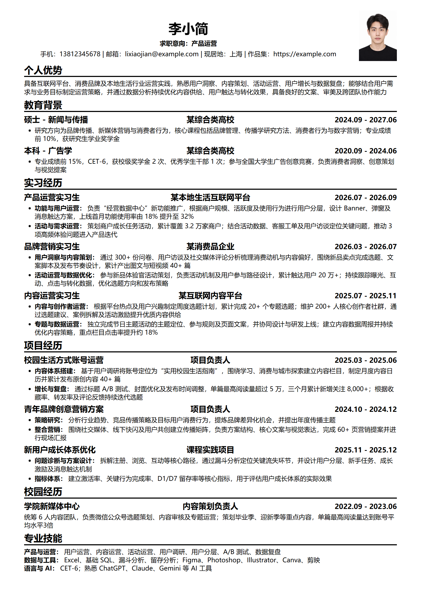
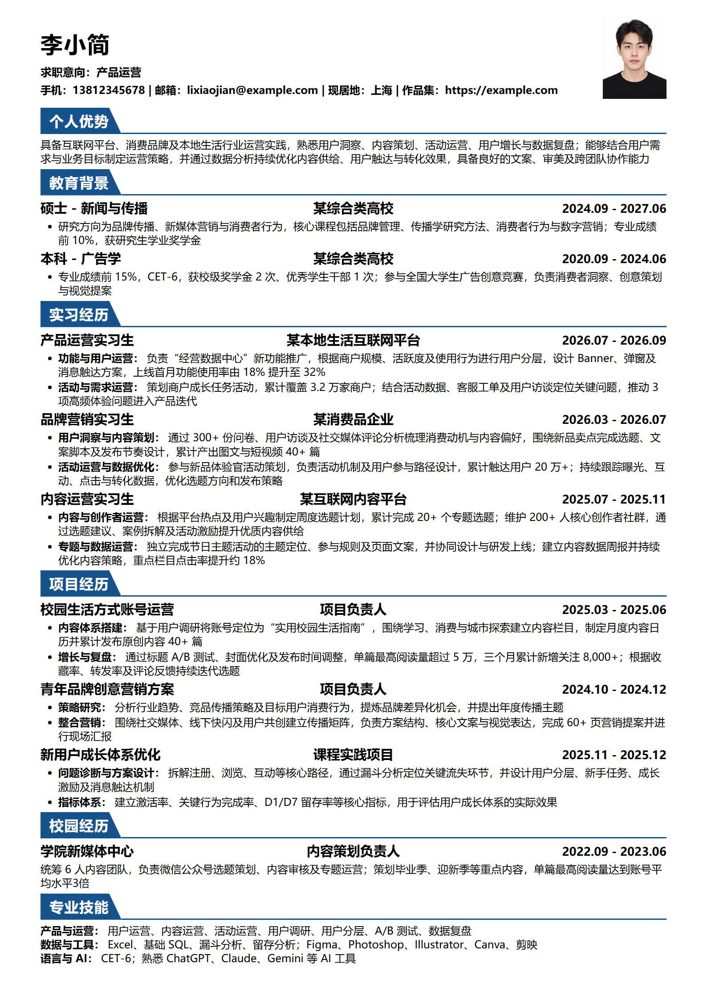

<div align="center">


# 小简 · Max-MD2CV

**专注打磨简历内容，少为排版费心。**

基于 Markdown 的简历工作台：实时预览、五款模板、智能一页，方便与 AI 协作，也方便管理多个岗位版本。

[](https://github.com/max-doo/max-md2cv/releases)
[](https://github.com/max-doo/max-md2cv/releases)
[](LICENSE)

[在线体验](https://max-md2cv.vercel.app/) · [下载桌面版](https://github.com/max-doo/max-md2cv/releases) · [快速开始](#quick-start) · [查看模板](#templates) · [反馈问题](https://github.com/max-doo/max-md2cv/issues)

**[产品特点](#features) · [与 AI 协作](#ai-workflow) · [安装 Agent Skill](#agent-skill) · [使用方式](#editions) · [常见问题](#faq) · [本地开发](#development) · [参与贡献](#contributing) · [许可证](#license)**

</div>



求职时，一份简历往往需要反复修改：补充一段经历、突出某个岗位需要的能力，再为下一次投递保存一个版本。小简将内容和样式分开，让你用清晰的文本维护经历，用模板完成排版，在同一个工作台里查看效果、调整版式并导出 PDF。

<a id="features"></a>

## ✨ 产品特点

| 你想完成的事 | 小简如何帮你 |
| --- | --- |
| 改内容时，马上看到效果 | 左侧 Markdown 编辑，右侧实时 A4 分页预览，随时检查内容长度和页面布局。 |
| 为不同岗位准备不同简历 | 桌面版支持本地工作空间、复制与重命名，从基础简历派生岗位版本，一岗一历。 |
| 让版式符合自己的习惯 | 调整字体、字号、行高、间距、页边距和主题色；可调项目随模板提供。 |
| 处理第二页多出的几行 | 点击「智能一页」，自动尝试更紧凑的排版，减少反复手调参数的时间。 |
| 选一套合适的简历风格 | 内置五款模板，同一份内容可以切换不同风格，无需重新填写。 |
| 和 AI 一起润色、压缩经历 | 用 Markdown 传递结构化内容，配合内置格式提示词，修改后直接粘回编辑器。 |
| 交付一份可阅读的简历 | 导出文本可复制的 PDF 或高清图片（PNG），预览与导出共用分页和样式规则。 |

### 内容先行，格式交给模板

姓名、教育背景、经历和技能通过标题与列表组织。你只需维护一份 Markdown 文本，就能切换模板、继续修改内容，也能把某一段经历单独交给 AI 优化。即使不熟悉 Markdown，也可以从内置示例开始，借助编辑器工具栏和语法说明逐步上手。

### 多个岗位版本，放进一个工作空间

桌面版将本地文件夹作为简历工作空间。保留一份基础简历，复制后针对岗位调整经历顺序、关键词和成果表达，再用清楚的名字保存，便于持续维护和查找。

```text
我的简历工作空间/
├── 基础简历.md
├── 品牌营销.md
└── 内容运营.md
```

### 智能一页，减少排版试错

当简历只是略微超出一页时，「智能一页」会尝试调整留白、间距、行高、页边距和字号，在可读性约束下寻找单页方案。它调整的是版式，简历正文由你决定；如果内容过多，仍可能保留多页并提示你进一步精简。

<a id="templates"></a>

## 🎨 五款模板，同一份内容的不同表达

所有内置模板均随项目免费提供。先选择接近投递场景的风格，再按需要微调颜色、字号和间距。

| 模板 | 视觉特点 | 可参考的使用场景 |
| --- | --- | --- |
| **稳重商务** · 默认 | 深蓝色块、矩形栏目标题，结构鲜明、信息紧凑 | 传统企业、商务及正式岗位 |
| **轻盈现代** | 圆角胶囊标题、图标与细蓝线 | 互联网、产品、运营等岗位 |
| **清雅简约** | 浅紫灰底、柔和留白，整体干净轻盈 | 通用求职、希望版面更舒展的场景 |
| **经典极简** | 黑白配色，以文字层级和横线组织内容 | 学术、金融、法律等偏正式场景 |
| **稳健政企** | 深蓝梯形切角标题、通栏底线，信息排列规整 | 政企、事业单位、高校等正式场景 |

下面展示同一份演示简历在五款模板中的效果，点击图片可查看完整尺寸。

| 稳重商务 | 轻盈现代 |
| :---: | :---: |
| [](doc/images/template-business-block.png) | [](doc/images/template-business.png) |

| 清雅简约 | 经典极简 | 稳健政企 |
| :---: | :---: | :---: |
| [](doc/images/template-modern.png) | [](doc/images/template-classic.png) | [](doc/images/template-slant-badge.png) |

<a id="quick-start"></a>

## 🚀 快速开始

### 使用桌面版

1. 在 [Releases](https://github.com/max-doo/max-md2cv/releases) 下载 Windows 安装包并安装。
2. 打开小简，选择一个本地文件夹作为简历工作空间，从示例开始编辑或打开已有 Markdown 简历。
3. 左侧修改内容，右侧查看预览；选择模板，按需调整字号、间距和主题色。
4. 内容略超一页时，可以尝试「智能一页」；投递其他岗位时，复制并重命名简历后再修改。
5. 检查最终分页效果，点击「导出为 PDF」或「导出图片」。桌面版导出需要系统中可用的 Edge 或 Chrome 等 Chromium 内核浏览器。侧边栏「导出」标签页可统一管理所有生成的 PDF 与图片文件。

### 从这份 Markdown 开始

以下为虚构的精简示例，可直接复制到编辑器。更完整的内容见 [内置演示简历](packages/resume-core/src/assets/templates/default-resume.md)。

```markdown
# 李小简

**求职意向：品牌营销 / 内容运营**

手机号码：13812345678 | 电子邮箱：lixiaojian@example.com | 现居地：上海 | 作品集：https://example.com

## 个人优势

熟悉内容策划、社交媒体运营与数据复盘，能够围绕用户需求组织选题和传播内容。

## 教育背景

### 本科 - 广告学 | 某综合类高校 [2020.09 - 2024.06]
- 核心课程：品牌管理、消费者行为、数字营销

## 实习经历

### 内容运营实习生 | 某互联网内容平台 [2025.07 - 2025.11]
- **内容策划：** 围绕用户兴趣制定周度选题计划，累计产出内容 30 篇。
- **数据复盘：** 跟踪阅读量、收藏率和互动率，持续调整选题方向。

## 专业技能

**内容与营销：** 文案撰写、内容运营、用户调研、活动策划

**工具：** Excel、Figma、剪映
```

`#` 表示姓名，`##` 划分模块，`###` 组织每段经历，`-` 展开职责与成果。经历标题中的日期请使用英文半角方括号，例如 `[2025.07 - 2025.11]`，模板会将其作为时间信息排版。标题信息按书写顺序分列，三项信息分别居左、居中、居右。例如 `### [2024.09 - 2027.06] 硕士 - 新闻与传播 | 某综合类高校` 会将日期放在左侧、学位与专业放在中间、学校放在右侧。`|` 用于分列，方括号日期旁的 `|` 可省略，排版后列间使用留白。需要手动分页时，可单独成行输入 `\page`。

<a id="ai-workflow"></a>

## 🤖 和 AI 一起改简历

Markdown 让简历成为易于复制、比较和修改的结构化文本。你可以把整份简历交给 AI 整理格式，也可以只修改一段经历，再粘回小简查看效果。

1. 打开编辑器工具栏中的「简历使用指南」，在「语法说明」标签页复制内置 AI 提示词。
2. 将提示词与原始经历交给你使用的 AI 工具，说明目标岗位和修改要求。
3. 核对生成内容中的事实、数据和日期，将 Markdown 正文粘回小简。
4. 查看实时预览，选择模板并调整版式，最后导出 PDF。

例如，你可以提出这样的修改要求：

> 请保留事实，将这段经历压缩为两条列表；突出与内容运营岗位相关的工作和成果，沿用现有 Markdown 层级与方括号日期格式。

AI 内容生成在你选择的外部工具中完成。使用支持 Agent Skill 的工具时，还可以安装下面的 `md2cv` Skill，让 Agent 持续按小简的格式修改、排版和导出简历。

<a id="agent-skill"></a>

### 安装与使用 md2cv Agent Skill

[md2cv Skill](skills/md2cv/SKILL.md) 将小简的格式规范与 CLI 工作流提供给 Agent。它可以：

- **整理与修改内容：** 根据原始经历或现有简历生成小简 Markdown，按目标岗位调整表达，保留真实事实、数据和日期。
- **参考格式与骨架：** 使用随 Skill 安装的 [格式参考](skills/md2cv/references/resume-format.md) 和 [简历骨架](skills/md2cv/assets/resume-template.md)，规范标题、联系方式、经历日期和列表。
- **排版与交付：** 通过 CLI 选择模板、生成 PDF 与逐页 PNG、调用智能一页，并在 Agent 能查看图片时检查所有页面。
- **按需准备 CLI：** 仅修改正文无需 CLI；导出、智能一页或排版验证时检查环境，缺少 CLI 则读取 [CLI 安装指引](skills/md2cv/references/cli-installation.md)。

**让 Agent 帮你安装。** 打开编辑器的「简历使用指南」，在「Skill 安装说明」标签页点击「复制安装提示词」，也可以直接复制以下内容：

```text
请帮我安装小简（Max-MD2CV）的 md2cv Agent Skill，供当前 Agent 在之后的简历任务中使用。

官方仓库：https://github.com/max-doo/max-md2cv
Skill 目录：skills/md2cv

请将完整的 md2cv 目录（包括 SKILL.md、references、assets 和 agents）安装到当前 Agent 支持的用户级 Skill 目录，保留已有的其他 Skill。可以使用以下命令，并指定当前 Agent 对应的 --agent 参数完成安装：
npx skills add max-doo/max-md2cv --skill md2cv --global --copy
若无法使用该安装工具，请从官方仓库获取完整 Skill 目录后安装，不要只复制 SKILL.md；已有同名 Skill 时先检查并保留本地修改。

安装后确认格式参考、简历骨架和 CLI 安装文档均存在，告诉我安装位置和如何调用；如果需要开启新会话才能加载，请说明。
仅修改简历正文不需要 CLI。之后我要求导出 PDF、检查排版或使用智能一页时，请检查 md2cv 是否可用；未安装时按 Skill 中的 references/cli-installation.md 引导我安装。
```

**在终端安装。** 安装 Node.js 和 Git 后，使用 [Skills CLI](https://github.com/vercel-labs/skills) 将 Skill 安装到所选 Agent 的用户目录：

```sh
npx skills add max-doo/max-md2cv --skill md2cv --global --copy
```

按安装工具提示选择 Agent。`--global` 表示跨项目使用；去掉该参数可安装到当前项目。`--copy` 复制完整目录，便于不支持符号链接的环境使用。也可以从本仓库的 `skills/md2cv` 手动复制完整目录到 Agent 的 Skill 目录。Skill 安装与 CLI 安装相互独立；安装 Skill 不会自动安装 CLI 或桌面版。

**开始使用。** 安装后在 Agent 中输入以下请求，并提供简历内容或文件路径。支持 `$md2cv` 的工具可以显式调用，其他工具按其 Skill 调用方式使用：

```text
用 $md2cv 把我的经历整理成小简格式的 Markdown 简历，目标岗位是内容运营。
用 $md2cv 修改 resume.md 的实习经历，保留事实，突出与目标岗位相关的贡献，其他部分不变。
用 $md2cv 将 resume.md 导出为 PDF 和逐页 PNG，使用 classic 模板，检查每一页。
用 $md2cv 对 resume.md 调用智能一页，输出到 output；如果内容仍超页，请说明原因，不删减正文。
```

仅修改内容时，可以把结果粘回桌面版或 Web；要求导出时，Agent 会使用 CLI。智能一页只调整版式，内容过多或存在手动分页时可能仍保留多页，结果会附超页提示。

<a id="editions"></a>

## 🧭 选择适合你的使用方式

| 使用方式 | 适合什么需求 | 内容存储与输出 |
| --- | --- | --- |
| **桌面版** | 长期维护简历，为多个岗位准备不同版本 | 本地文件夹工作空间，管理 Markdown 与 PDF 文件，支持 PDF 导出 |
| **[Web Playground](https://max-md2cv.vercel.app/)** | 在浏览器中体验编辑、模板和版式调整 | 当前草稿保存在浏览器本地，支持 Markdown 导入与内容复制，使用浏览器打印另存为 PDF |
| **CLI** | 在终端或 AI 智能体流程中生成简历文件 | 读取 Markdown，输出 PDF、逐页 PNG，并可返回 JSON 结果 |

无需安装，打开 [Web Playground](https://max-md2cv.vercel.app/) 即可在线体验。Web 的本地运行方法见 [本地开发](#development)。它提供单份草稿体验；需要文件夹工作空间与多版本管理时，使用桌面版。

### CLI 渲染与智能一页

CLI 使用系统中的 Edge、Chrome 或 Chromium 渲染，与桌面版和 Web 共用核心模板与排版规则。以下命令从仓库源码构建并安装 CLI，需要 Node.js 20+ 和可用的浏览器：

```powershell
npm install
npm run build:cli
npm install --global ./apps/cli

md2cv doctor
md2cv templates list
md2cv render ./resume.md --template classic --output-dir ./output
md2cv render ./resume.md --template classic --one-page --output-dir ./one-page --json
```

默认生成 PDF 和每页一张 PNG。`--one-page` 调用与界面相同的智能一页算法；JSON 中的 `onePage.fitted` 表示是否成功适配，`effectiveValues` 返回最终排版参数。无法压到一页时仍导出完整内容并附超页警告。`--max-pages 1` 仅提示超页，不执行自动适配。

需要机器可读结果时使用 `--json`；浏览器不在常见安装路径时，可通过 `--browser-path` 或 `MD2CV_BROWSER_PATH` 指定。完整安装步骤见 [CLI 安装指引](skills/md2cv/references/cli-installation.md)，命令与配置见 [CLI README](apps/cli/README.md)。npm 包发布后也可通过 `npm install --global @max-md2cv/cli` 安装；官方源返回 `E404` 时使用源码安装方式。

<a id="faq"></a>

## 💬 常见问题

### 不会 Markdown，可以使用吗？

可以从内置示例开始修改。简历主要使用标题、加粗和列表，编辑器工具栏与语法说明提供常用操作，也可以使用内置提示词让 AI 将草稿整理为所需格式。

### 智能一页一定能压到一页吗？

它更适合内容略微超出一页的情况。经历较多时，建议精简与岗位关联较弱的内容，或保留清晰的多页排版；自动调整完成后仍应检查阅读效果。

### 简历保存在哪里？

桌面版的简历文件保存在你选择的本地工作空间。Web 草稿保存在当前浏览器的本地存储中，清理站点数据会移除草稿，建议复制 Markdown 内容并保存到本地文件留存。使用外部 AI 工具时，分享哪些内容由你自行选择。

### PDF 导出失败怎么办？

桌面版先检查 Edge 或 Chrome 等浏览器是否可用，并等待预览完成后重试。Web 版需要允许打印窗口弹出，在浏览器打印界面选择「另存为 PDF」。CLI 可以先运行 `md2cv doctor` 检查运行环境。

### 可以制作自己的模板吗？

桌面版支持用户模板与样式覆盖。模板定义、字段和加载规则见 [模板创建指南](doc/模板创建指南.md)，可从内置模板出发制作自己的风格。

<a id="development"></a>

## 🛠️ 本地开发

本项目采用 npm workspaces，包含 Tauri 桌面应用、Web Playground、独立 CLI，以及共享的简历核心与浏览器渲染器。

### 环境准备

- **Web / CLI / 前端开发：** Node.js 20+ 与 npm。
- **桌面开发：** 在上述环境基础上安装 Rust；Windows 还需要 MSVC 构建工具与 WebView2 运行环境。
- **桌面 PDF 导出 / CLI 渲染：** 可用的 Edge、Chrome 或 Chromium 浏览器。

### 获取源码并运行

```powershell
git clone https://github.com/max-doo/max-md2cv.git
cd max-md2cv
npm install
```

| 目标 | 命令 | 说明 |
| --- | --- | --- |
| 桌面开发 | `npm run tauri dev` | 启动前端开发服务并编译 Tauri 桌面应用 |
| Web 开发 | `npm run dev:web` | 默认访问 `http://localhost:4173` |
| 前端构建 | `npm run build` | 执行桌面前端类型检查与构建 |
| Web 构建 | `npm run build:web` | 执行 Web 类型检查与构建 |
| Web 构建预览 | `npm run preview:web` | 本地预览已构建的 Web 应用 |
| CLI 构建 | `npm run build:cli` | 构建命令行入口、渲染器及运行资源 |
| 桌面安装包 | `npm run tauri build` | 输出位于 `src-tauri/target/release/bundle` |

桌面打包的详细步骤见 [打包指南](doc/打包指南.md)。当前仓库的桌面打包目标为 Windows NSIS 安装包。

### 项目结构

```text
max-md2cv/
├── src/                         # 桌面 Vue 前端，部分组件供 Web 复用
│   ├── components/              # 编辑器、预览、侧栏及共享组件
│   ├── stores/resume/           # 桌面 Pinia 状态与工作空间逻辑
│   ├── assets/                  # 主题样式、字体与 Logo
│   └── utils/                   # 分页、导出、外部链接与编辑辅助工具
├── src-tauri/                   # Rust 后端、文件操作与桌面打包
├── apps/
│   ├── web/                     # Web Playground 与浏览器草稿状态
│   └── cli/                     # 独立 md2cv 命令行工具
├── packages/
│   ├── resume-core/             # 共享解析、模板定义、样式与工具
│   │   └── src/assets/templates/ # 五款内置模板与演示简历
│   └── resume-renderer/         # 共享浏览器端渲染器
├── skills/md2cv/                # 简历修改、格式参考与渲染 Agent Skill
├── scripts/                     # CLI 集成、渲染及打包验证
├── doc/                         # 模板、打包与开发文档
├── design/                      # 设计稿与设计系统资料
└── LICENSE                      # MIT 许可证
```

### 技术与设计

界面采用柔和极简的设计方向，以层次、留白和柔和阴影组织编辑空间。前端使用 **Vue 3、TypeScript、Vite、Pinia 和 Tailwind CSS v4**，配合 CodeMirror 6 提供 Markdown 编辑；简历解析使用 marked，分页使用 Paged.js。桌面应用由 **Tauri v2 与 Rust** 提供文件操作和系统集成，CLI 通过 Playwright Core 调用系统浏览器。

<a id="contributing"></a>

## 🤝 参与贡献

欢迎提交使用反馈、模板改进、文档修正和代码贡献。

- **反馈问题：** 在 [Issues](https://github.com/max-doo/max-md2cv/issues) 描述使用端、版本、系统或浏览器、复现步骤，以及预期和实际结果。排版问题可附脱敏后的最小 Markdown 示例和截图。
- **提出功能建议：** 说明你想完成的任务、遇到的阻碍，以及现有功能为何不能满足需求。
- **提交代码：** Fork 仓库并创建分支，保持修改范围清晰，在 Pull Request 中说明问题、改动和验证结果。较大的功能或架构调整建议先通过 Issue 讨论。
- **贡献模板：** 参考 [模板创建指南](doc/模板创建指南.md)，同时检查预览、分页与 PDF 导出效果。

开发前请阅读 [AGENTS.md](AGENTS.md)。共享组件修改会同时影响桌面版和 Web；验证应覆盖受影响的使用端。

按修改范围选择已有检查：

| 检查 | 命令 |
| --- | --- |
| 桌面前端类型检查与构建 | `npm run build` |
| Web 类型检查与构建 | `npm run build:web` |
| 外部链接单元测试 | `npx vitest run src/utils/externalLink.test.ts` |
| CLI 单元测试 | `npm run test:cli` |
| 共享渲染器回归 | `npm run test:cli:renderer` |
| CLI 端到端渲染 | `npm run test:cli:e2e` |
| CLI 打包与安装验证 | `npm run test:cli:pack` |

渲染相关检查需要可用的系统浏览器。具体测试准备和命令以仓库现有脚本为准。

<a id="license"></a>

## 📄 许可证与致谢

本项目采用 [MIT License](LICENSE)，允许使用、修改和分发，具体权利与条件以许可证正文为准。

感谢 Tauri、Vue、Vite、Pinia、CodeMirror、marked、Paged.js、Tailwind CSS、Element Plus 和 Playwright 等开源项目，以及提交反馈与贡献的每一位参与者。

如果小简帮你减少了修改简历的时间，欢迎 [Star 项目](https://github.com/max-doo/max-md2cv)，或分享你的使用建议。
